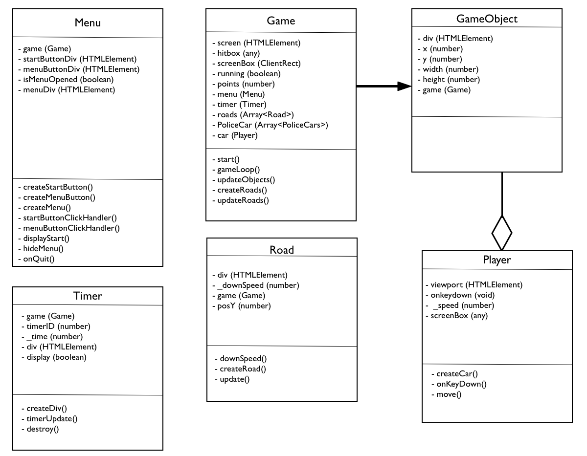

A Racing-game made in Typescript (OOP) & HTML5, for a school assignment. The classes used for this game are shown below in the UML. Each class has certain properties and methods.

<a href="https://stud.hosted.hr.nl/0914922/race_game/" target="_blank">Try the Demo here!</a>

<h1>Info</h1>
 
  * Made in Typescript, to understand OOP principals, 
  * Compiled with Visual Studio,

<h1>UML Diagram</h1>

<h1>OOP</h1>

1. Classes and instances
  * Everything is written in classes and uses instances of these classes. Shown below in the UML.
2. Encapsulation
  * Private properties and methods are prefixed with _ underscore and are doc blocked.
3. Composition
  * The classification of my classes and instances is organized in the most logical way. 
4. Inheritance
  * The GameObjects classes make use of inheritance.

